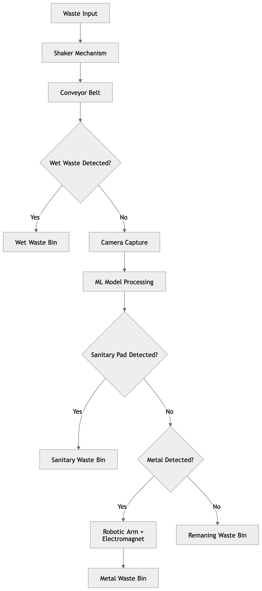

# Smart Waste Segregation System


ML-powered waste segregation prototype combining computer vision, moisture sensing, metal detection, and robotic actuation.

## Problem Statement

Manual waste segregation is slow, unsafe, and inconsistent, especially for sanitary and mixed waste. This project proposes a low-cost automated segregation pipeline that identifies wet waste, sanitary waste, metal waste, and general waste using a combination of ML and hardware modules.

## Dataset / Source

The project includes model artifacts and detection scripts for sanitary waste classification. Hardware and system design details are documented in `docs/technical_paper_waste_segregation.pdf`.

## Tech Stack

- Python
- OpenCV
- NumPy
- Machine Learning / Computer Vision
- Moisture sensor
- Servo motors
- Robotic arm
- Electromagnet

## Workflow

1. Prepare image dataset.
2. Train sanitary waste detection model.
3. Detect wet waste using moisture sensing.
4. Detect and separate metal waste using electromagnet and robotic arm.
5. Sort remaining waste as general waste.

## Methodology

- Computer vision classifies sanitary waste.
- Moisture sensing identifies wet waste.
- Metal detection separates metallic objects.
- A shaker/conveyor mechanism improves single-item flow.
- Robotic actuation performs physical separation.

## Key Features

- Sanitary waste detection
- Metal separation with robotic arm
- Moisture-based wet waste signal
- Low-cost prototype design
- Technical paper and system flowchart

## Results / Metrics

- Approximate sanitary waste detection accuracy: 90%
- Prototype cost target: around ₹8,500
- Modular hardware/software pipeline

## Screenshots



## How to Run Locally

```bash
pip install -r requirements.txt
pytest -q
```

Individual detection/training scripts are available in `src/`.

## Folder Structure

```text
.
├── data/
├── docs/
├── notebooks/
├── reports/
├── screenshots/
├── src/
├── tests/
├── README.md
└── requirements.txt
```

## Future Improvements

- Expand classification to plastic, paper, glass, and organic waste.
- Add IoT monitoring dashboard.
- Improve robotic arm speed and precision.
- Add more labeled image data and model evaluation reports.
